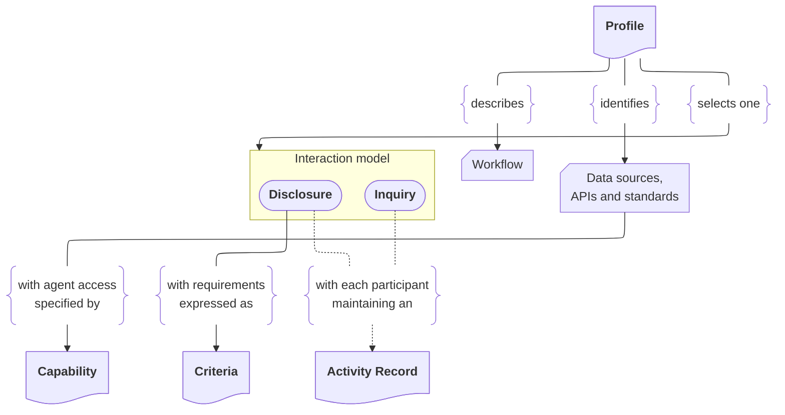

# Conversational Interoperability (COIN)

Conversational Interoperability (COIN) describes an approach to healthcare
interoperability in which AI agents help participants exchange and interpret
information and coordinate workflows. Agents can clarify what each participant
needs, find relevant information in their respective systems, resolve differences
in how that information is represented or understood, and exchange it in a form
the receiving participant can use.

Agents can use structured exchanges, natural-language dialogue, or both,
depending on the task. This approach could reduce the effort needed to build and
maintain custom integrations, helping organizations adapt more readily as
systems, requirements, and workflows change.

This proposal outlines an approach to putting COIN into practice. Building on
existing standards, APIs, and data sources, the proposed specification establishes
shared expectations for agent behavior, interactions, and outputs. It aims to
combine the flexibility of AI with the predictability, transparency, and
accountability needed for safe and reliable healthcare interoperability.

## Initial focus

The initial focus is on helping one participant understand another’s evaluation
requirements and prepare the data and evidence needed for that evaluation.

In prior authorization, for example, a provider’s agent asks a payer’s agent
which requirements apply to a requested service and clarifies what evidence is
needed. The provider’s agent then gathers relevant patient information,
assesses it against those requirements, and identifies missing or conflicting
evidence for review.

Similar preparation tasks arise in quality measurement, clinical trial
matching, and specialist referrals. Each workflow would define the
required outputs, how findings are reviewed and used, and who makes subsequent
decisions.

## Specification structure

### Interaction models

This proposal presents two distinct interaction models for information
exchange. In one, evaluation requirements are supplied upfront to guide an agent
in gathering and assessing evidence. In the other, an iterative exchange of
questions and answers from either participant guides what they retrieve, explain,
and ask next. Each model describes what participants are expected to do, what
they exchange, and how they coordinate their work.

#### Disclosure

[Disclosure](disclosure/index.md) helps one participant prepare evidence for
another participant's evaluation. The applicable requirements are supplied
upfront as [Criteria](criteria/index.md), giving the participant preparing
evidence a basis for deciding what information to gather and how to assess it.

The Preparer is the agent preparing the evidence. It gathers relevant
information, records findings and gaps, and asks for clarification when needed.
The Evaluator supplies the Criteria and explains their meaning on behalf of the
participant responsible for the evaluation. The Disclosure protocol defines their
exchanges, including optional checks of individual evidence items.

#### Inquiry

[Inquiry](inquiry/index.md) is a proposed interaction model based on an iterative
exchange of questions and supported answers. Either participant can ask
questions, seek clarification, or request supporting evidence. The conversation
guides what information to retrieve and what to ask next. Participants make gaps
and uncertainty clear.

The Preparer gathers information and prepares supported answers and evidence.
The Evaluator asks and refines questions and reviews the information supplied.
Inquiry can support this exchange without a predefined set of evaluation
requirements.

### Artifacts

Artifacts are the descriptions and records that participants use or produce as
they carry out work with COIN. Their shared definitions help participants
interpret and use information consistently, even when they work across different
systems and organizations.

#### Profile

A [Profile](profile/index.md) describes the workflow for a use case and how COIN
fits within it. It identifies the participants, their responsibilities, the
sequence of activities, and the information exchanged. It specifies the use of
data sources, APIs, and standards, along with review and decision points,
handoffs, and safeguards.

Each Profile uses either Disclosure or Inquiry and defines the tasks and outputs
expected from participating agents. For example, a prior authorization Profile
can describe the workflow for preparing, submitting, evaluating, and responding
to a request, and identify the steps supported by COIN.

#### Capability

A [Capability](capability/index.md) specifies a set of related operations made
available to agents through the Model Context Protocol (MCP). Each Capability
has a type, with `data-access` as the only currently defined type. Profiles
contain the Capability definitions, including their MCP tools, data requirements,
and the participant roles that need them. Implementations provide those operations
and the required access under the Profile's rules.

#### Criteria

[Criteria](criteria/index.md) represents evaluation requirements as readable
statements with explicit logical relationships. It identifies individual
requirements so agents can connect evidence, findings, and clarification requests
to what is being assessed. Disclosure uses this representation to supply
requirements upfront.

#### Activity Record

An [Activity Record](activity-record/index.md) documents a participant's work,
linking relevant actions and exchanges to the information used, outputs produced,
and limitations encountered. It supports audit and transparency by giving
authorized reviewers a basis for examining those results. Each participant
maintains its own record, with references to shared exchanges connecting the
records.

## Use cases

Use case [Profiles](profile/index.md) show how COIN’s components fit together in
specific healthcare workflows. They make the approach easier to understand and
provide concrete examples for identifying gaps and refining the specification.

Use case Profiles are being developed and will be published soon. To suggest a
use case or collaborate on developing a Profile, contact
[coin@mitre.org](mailto:coin@mitre.org).

## Copyright and trademarks

©2026 The MITRE Corporation. ALL RIGHTS RESERVED. Approved for Public Release; Distribution Unlimited. Public Release Case Number 26-2020

Third-party standards and terminology are subject to their respective copyright
and licensing terms. [HL7® and FHIR®](https://hl7.org/fhir/R5/license.html) are
registered trademarks of Health Level Seven International.
[SNOMED CT®](https://www.snomed.org/get-snomed) is copyright SNOMED International.
References do not imply endorsement.
