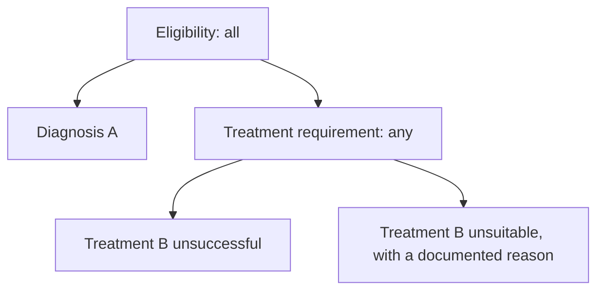

# Criteria

Criteria represents evaluation requirements in a form that
people can read and AI agents can interpret. It combines plain-language
criteria with explicit logic and links to accepted clinical concepts.
An agent can use this description to identify the data and evidence needed for
an evaluation, such as prior authorization, quality measurement, clinical trial
matching, or specialist referral review.

The format sits between prose and executable code. It makes relationships such
as "all of these criteria" or "at least one of these alternatives" explicit,
while retaining text for qualifications and clinical judgment. It does not
prescribe a clinical data model or require a complete executable implementation.
Clear structure reduces ambiguity, but interpreting the statements may still
require clarification.

Each criterion also has an identifier that agents can use to link collected
evidence and clarification requests to a specific requirement. This makes it
easier to review the evidence for each criterion and resolve questions about its
meaning.

A criteria set is a complete Criteria representation of evaluation
requirements, combining individual criteria, their logical relationships, and
metadata.

## Tutorial: from a requirement to a criteria set

Consider this hypothetical requirement for authorization of a service:

> The patient must have diagnosis A. In addition, either previous treatment B
> was unsuccessful, or there must be a documented reason that treatment B is
> unsuitable for the patient.

This tutorial uses fictional service X, diagnosis A, and treatment B to
illustrate the format.

### Step 1. Identify the criteria and their relationships

A criterion is an individual requirement that can be assessed independently.
This example has three criteria:

- The patient has diagnosis A.
- Previous treatment B was unsuccessful.
- There is a documented reason that treatment B is unsuitable for the patient.

The diagnosis criterion is required, and either treatment criterion can meet the
treatment requirement. Both treatment criteria may also be satisfied. In the
format, `all` expresses the first relationship and `any` expresses the alternatives:



An expression combines criteria or other expressions using a logical
operator. Naming the treatment expression allows the eligibility expression to
refer to that combination.

These two building blocks have different jobs:

| Building block | Job | In this example |
| --- | --- | --- |
| `criteria` | State the individual requirements to assess. | Whether the patient has diagnosis A. |
| `expressions` | Combine criteria or other expressions. | The diagnosis criterion and either treatment criterion must be satisfied. |

Each criterion and expression has an `id`. An expression's `operands` lists
the IDs of the criteria or expressions it combines. The workflow supplies the
evaluation context. Here, "the patient" means the patient for whom authorization
of service X is requested.

### Step 2. Assemble the criteria set in JSON

The complete criteria set adds an identifier and metadata describing its title,
revision, and source. Statements remain readable text; references use the exact
IDs assigned to other entries.

The optional top-level `result` identifies the expression that supplies
the criteria set's overall finding. Here, it selects `eligibility` from the
`expressions` array.

```json
{
  "id": "tutorial-authorization",
  "metadata": {
    "version": "draft",
    "title": "Authorization of service X",
    "source": "Hypothetical requirement for this tutorial"
  },
  "criteria": [
    {
      "id": "diagnosis",
      "statement": "The patient has diagnosis A."
    },
    {
      "id": "treatment-unsuccessful",
      "statement": "Previous treatment B for the patient was unsuccessful."
    },
    {
      "id": "treatment-unsuitable",
      "statement": "There is a documented reason that treatment B is unsuitable for the patient."
    }
  ],
  "expressions": [
    {
      "id": "treatment-requirement",
      "operator": "any",
      "operands": ["treatment-unsuccessful", "treatment-unsuitable"]
    },
    {
      "id": "eligibility",
      "operator": "all",
      "operands": ["diagnosis", "treatment-requirement"]
    }
  ],
  "result": "eligibility"
}
```

To understand `eligibility`, follow its references. Both `diagnosis` and
`treatment-requirement` must be satisfied. The latter needs at least one of
its two referenced criteria to be satisfied. Array order has no logical meaning.

The name `eligibility` has no special behavior; `result` explicitly
selects it. Other expressions remain independently assessable. A criteria set
can omit `result` when its expressions support several findings, such as measure
population membership, without declaring a single overall finding.

### Step 3. Use the requirements to prepare evidence

An agent interpreting this criteria set can seek evidence for the diagnosis and
treatment criteria, associate that evidence with their IDs, and request
clarification about a specific statement. For example, if "unsuccessful" is
insufficiently defined, a clarification request can identify
`treatment-unsuccessful` within this criteria set and version.

Assessing evidence against a criterion or expression produces a finding of
satisfied, not satisfied, or unresolved.
Missing or conflicting evidence may leave a criterion unresolved. Whether missing
documentation establishes that a criterion is not satisfied depends on what the
criterion requires. See [Interpreting missing evidence](#interpreting-missing-evidence).

The following cases illustrate how the tutorial's expressions behave. Because
`eligibility` is selected by `result`, its state is also the criteria
set's overall finding:

| Diagnosis | Treatment unsuccessful | Treatment unsuitable | Eligibility |
| --- | --- | --- | --- |
| Satisfied | Satisfied | Unresolved | Satisfied |
| Satisfied | Not satisfied | Unresolved | Unresolved |
| Satisfied | Not satisfied | Not satisfied | Not satisfied |
| Not satisfied | Unresolved | Unresolved | Not satisfied |

An unresolved criterion does not always prevent an expression from being
resolved. In the first row, one treatment alternative establishes the `any`
expression. In the last row, the diagnosis criterion prevents the `all`
expression from being satisfied regardless of the treatment evidence.

These are interpretations of the criteria set, not fields to add to the JSON.
The criteria set remains the same across patients; evidence references and
findings are recorded as defined by
[Agent](../agent/index.md#common-agent-record).

## Adding precision

The basic structure also supports more detailed requirements. The following
choices help authors preserve the source's meaning as complexity grows.

### Keep qualifications with the criterion they explain

A criterion should express one independently assessable requirement, with enough
text to interpret it. A threshold needs its units, a time limit needs its
starting point, and a clinical judgment needs whatever qualifications the source
provides. Several sentences may be needed to state one criterion.

For example, a source might explain what counts as unsuccessful treatment.
That explanation belongs in the statement of `treatment-unsuccessful`.
A separate requirement, such as adequate organ function, belongs in another
criterion and is combined through `expressions`.

The structure cannot supply details the source leaves unspecified. Preserve
those gaps for review or clarification instead of inventing a threshold or
assuming that an explanatory example exhausts the accepted possibilities.

### Separate pathways from accepted values

Use separate criteria when alternatives require different kinds of events or
different timing, results, or other qualifications. Combining them through
`any` gives each pathway an ID for evidence and clarification requests.

In the [hypothetical home monitor training example](examples/home-monitor-training.json),
training can be documented through an observed demonstration or through a
coaching call followed by a linked practice upload. The remote pathway combines
two criteria with `all`; `training-confirmed` combines the two pathways with
`any`. Each event retains its own timing and evidence requirements.

Accepted values for the same test can stay together. The `monitor-received`
criterion accepts two fictional device models with the same delivery and timing
requirements. They share one binding listing both synthetic codes.
See [Decomposing requirements](#decomposing-requirements) for the rules governing
this boundary.

### Keep evidence in the right context

The workflow identifies who or what is being evaluated. Criteria can refer to
"the patient" or "the transplant" within that context. Statements must still
make source-specific meanings, selection rules, and relationships clear.

Suppose a requirement concerns an unsuccessful treatment course lasting at
least six weeks. Evidence of a six-week successful course and a shorter
unsuccessful course cannot jointly establish that requirement. The criterion can
state "The patient received a course of treatment B that lasted at least six
weeks and was unsuccessful." The [multiple myeloma example](examples/multiple-myeloma.json)
similarly keeps the required decrease and its duration tied to the same response
to a chemotherapy course.

When several criteria concern the same event or study, their statements must
preserve that relationship. Reusing a category such as "qualifying encounter"
does not by itself require the same encounter. State which occurrence, or how
many occurrences, are required. Assessment periods also need an identifiable
date range and any timing precision specified by the source.

### Bind terms to accepted clinical concepts

When a requirement restricts a term to specified concepts, a binding attaches
those concepts to the term. Each entry in `bindings` can list codes from a code
system or reference a value set, which defines a set of accepted concepts.

For example, this would replace the tutorial's `diagnosis` criterion if the
hypothetical source restricted "diagnosis A" to the concept identified below.
The code and system URI are fictional.

```json
{
  "id": "diagnosis",
  "statement": "The patient has diagnosis A.",
  "bindings": [
    {
      "term": "diagnosis A",
      "codes": [
        {
          "system": "https://example.org/clinical-concepts",
          "code": "diagnosis-a",
          "version": "1",
          "display": "Diagnosis A"
        }
      ]
    }
  ]
}
```

A binding is part of the requirement. Concepts outside it do not qualify, so
codes should not be added merely as suggestions. Put each binding on the
criterion whose statement uses the term.

Evidence in another representation can support an accepted concept when
equivalence is established and the requirement permits that representation.
A matching concept still needs the subject, timing, and other qualifications
stated in the criterion. See [Binding](#binding) for the
complete interpretation rules.

### Express exclusions and counts explicitly

Use `not` to negate a criterion or expression. For example, a requirement that
a treatment have no contraindication can negate a criterion stating that a
contraindication is present. An unresolved contraindication remains unresolved
after negation.

Use `at-least`, `at-most`, or `exactly` with a `count` when the requirement
specifies how many referenced criteria or expressions must be satisfied. These
operators count only their direct references. For example, `at-least` with
`count: 2` can require two of three referenced criteria to be satisfied.

For a rule requiring two visits, the number of visits belongs in a criterion's
statement. An operator counts satisfied criteria or expressions in
its `operands` list, regardless of how many records support each one.
See [Operator meaning](#operator-meaning) for all six operators and their
treatment of uncertainty.

### Choose an overall result when appropriate

Use [`result`](#result) when one expression answers the criteria set's overall
question. Omit it when no single overall finding is intended, such as separate
findings for a quality measure's initial population, denominator, and numerator.

## Examples

The complete examples illustrate how the same format scales from a small set
of criteria to multiple related expressions that support separate findings.
Each identifies its source in `metadata.source`.

| Example | What to look for |
| --- | --- |
| [Bariatric surgery](examples/bariatric-surgery.json) | Three criteria combined by one `all` expression. Statements describe thresholds and clinical qualifications for the patient being evaluated. |
| [Hypothetical home monitor training](examples/home-monitor-training.json) | Alternative evidence pathways, population membership expressions, and synthetic terminology bindings. Illustrative; not a validated clinical measure. |
| [Hypothetical clinical trial matching](examples/clinical-trial-matching.json) | Two inclusion criteria, one exclusion using `not`, and a `potential-match` expression selected by `result`. |
| [Hypothetical sleep-clinic referral](examples/specialist-referral.json) | Service scope, conditional report requirements, and information completeness. Original teaching example with synthetic terminology. |
| [Stem cell transplantation for multiple myeloma](examples/multiple-myeloma.json) | Patient and transplant requirements, alternative coverage pathways, and study participation with an authoritative determination of study qualification. Separate expressions support findings about coverage, explicit noncoverage, and local determination. |

The expression names describe their purpose. Their behavior comes from their
operators and references. In particular, failure to satisfy a covered pathway
does not automatically establish an explicit noncoverage finding.

## Format reference

This section defines the proposed format and its interpretation rules.
These remain proposed rules subject to revision. The tutorial illustrates their
use; it does not add fields or requirements.

### Fields and types

- [Criteria set](#criteria-set-structure)
- [Metadata](#metadata)
- [Criterion](#criterion)
- [Expression](#expression)
- [Binding](#binding)
- [Code](#code)
- [ValueSet](#valueset)
- [Reference](#reference)

### Rules

- [Field conventions](#field-conventions)
- [Decomposing requirements](#decomposing-requirements)
- [Interpreting missing evidence](#interpreting-missing-evidence)
- [Result](#result)
- [Operator meaning](#operator-meaning)
- [Reference rules](#reference-rules)
- [Identifiers and versions](#identifiers-and-versions)
- [Validation](#validation)

### Criteria set structure

A criteria set is represented as a single JSON object defining evaluation
requirements for reuse across evaluations. Subject data, collected evidence,
and findings are external to it.
In the tables, `T[]` means a JSON array of items of type `T`. Named
[data types](#data-types) are defined below. `Reference<T>` means a JSON string
identifying an entry of type `T` in the same criteria set; see
[Reference](#reference).

| Field | Type | Required | Allowed values and meaning |
| --- | --- | --- | --- |
| `id` | string | Yes | An identifier for the criteria set. See [Identifiers and versions](#identifiers-and-versions). |
| `metadata` | [Metadata](#metadata) | Yes | Criteria set version, title, and source information. |
| `criteria` | [Criterion](#criterion)[] | Yes | One or more independently assessable requirements. |
| `expressions` | [Expression](#expression)[] | Yes | Zero or more named logical expressions. An empty array declares no combinations of criteria. |
| `result` | [`Reference<Expression>`](#reference) | No | The exact ID of the expression that supplies the criteria set's overall finding. See [Result](#result). |

#### Result

`result` is a `Reference<Expression>` identifying an entry
in the same criteria set's `expressions` array. It must resolve to an existing
expression; criteria are not allowed targets. It must be omitted
when `expressions` is empty. A criteria set can designate at most one result
expression. The selected expression may also be referenced by other expressions.

The criteria set's overall finding is the selected expression's state:
satisfied, not satisfied, or unresolved, following the
[operator rules](#operator-meaning). This field selects the expression to assess;
it does not store a finding. A not-satisfied finding does not by itself
establish another finding, such as an explicit noncoverage indication.

When `result` is omitted, no single overall finding is declared. Consumers must
not infer one from names, array order, or which expressions are referenced by
others. All expressions remain independently assessable, and the selection does
not prescribe an assessment order. A
[Profile](../profile/index.md) may require
`result` when its workflow needs a single overall finding.

#### Field conventions

These rules apply to every object in the criteria set:

- Only the fields listed for that object type are allowed. Field names are
  case-sensitive and must not be repeated within an object.
- Required fields must be present. Optional fields are omitted when unused.
  `null` is not an allowed value for any field.
- Values must have the specified type. Types are not inferred or converted.
- Primitive type names are lowercase. `string` is a JSON string; `integer`
  is a JSON number with no fractional part, not a string or boolean.
- Identifier strings, including `id`, `result`, and entries in
  `operands`, are compared exactly, including case, without normalization.
- No maximum string length or array size is prescribed. Minimum array sizes and
  restrictions on array contents are specified for each field.

### Data types

`Reference<T>` is represented as a JSON string. The other types below are JSON
objects with the listed fields. Type names and the `<T>` notation describe the
format; they are not additional JSON fields.

#### Metadata

A `Metadata` object describes the criteria set's revision, title, and source.

| Field | Type | Required | Allowed values and meaning |
| --- | --- | --- | --- |
| `version` | string | Yes | Text identifying the criteria set's revision. There is no prescribed version-number format. |
| `title` | string | Yes | A readable name for the criteria set. |
| `source` | string | Yes | Text identifying the policy, measure, or other origin of the evaluation requirements. Include its version or relevant section when needed to distinguish the source. |

#### Criterion

Each entry in `criteria` is a `Criterion`, an independently assessable requirement
that clarification requests and evidence records can address by its ID.

| Field | Type | Required | Allowed values and meaning |
| --- | --- | --- | --- |
| `id` | string | Yes | An identifier unique across criteria and expressions in this criteria set. |
| `statement` | string | Yes | Text stating the requirement to assess, including any explanations of terms, qualifications, or limits of interpretation needed to understand it. |
| `bindings` | [Binding](#binding)[] | No | One or more bindings defining accepted concepts for terms in this statement. |

The plain-language statement expresses thresholds, units, temporal relationships,
and other qualifications with the context needed to interpret them. It may use
several sentences to define terms, describe relevant evidence, or identify
details the source leaves unspecified. The statement must be interpretable in
the evaluation context supplied by the workflow. Actual subject identifiers and
event records belong to that workflow. Bindings constrain accepted concepts.

An additional independently assessable requirement belongs in its own criterion,
with any relationship defined in `expressions`. The
[decomposition rules](#decomposing-requirements) distinguish separate requirements
from qualifications within one criterion.

A criterion is defined once and can be referenced by multiple expressions.
A criterion need not be referenced by an expression to be assessed or clarified
individually. The order of criteria does not imply priority or a relationship
between them.

##### Decomposing requirements

- Separate requirements and alternative pathways must be combined through
  expressions. Alternatives that require different kinds of events or different
  timing, result, or other qualifications must be separately addressable as
  criteria or expressions.
- A criterion may retain the qualifications needed to assess one fact or event,
  including its subject, timing, status, result, thresholds, and clinical
  qualifications. It may list accepted codes or categories when all remaining
  requirements are identical. Individual accepted values do not require separate
  criteria.
- Decomposition must preserve relationships to the same subject or event.
  Statements must keep those relationships explicit when requirements are
  split into separate criteria. Splitting a requirement must not allow different
  events to satisfy qualifications that the source applies to one event.

For example, a qualifying encounter and an encounter during the assessment
period cannot satisfy a requirement for one qualifying encounter during that
period unless they are the same encounter. Both qualifications can remain in
one criterion. The presence of words such as "and" or "or" in a statement does
not by itself determine whether decomposition is required.

##### Interpreting missing evidence

A criterion should distinguish a fact about a subject from a requirement for
documentation. Preserve the source's meaning and its treatment of absent records
and missing field values for each criterion.

For example, "treatment was unsuccessful" differs from "the submission documents
unsuccessful treatment." Missing documentation alone leaves the first unresolved.
The second can be not satisfied if the documentation is absent from the specified
submission.

If the source defines absence of a qualifying record as not satisfied, apply
that rule to a completed assessment. The
[hypothetical home monitor training example](examples/home-monitor-training.json)
requires records to establish every stated qualification; a record missing a
required date does not establish a match. When a requirement specifically concerns
a particular submission or collection, identify that scope in its statement.

The workflow or applicable
[Profile](../profile/index.md) identifies the input
scope, establishes when data collection is ready for assessment, and handles
retrieval failures. A failed or unfinished retrieval must not silently become an
empty matching collection.

After applying the source's rules, a criterion remains unresolved if the
available information cannot establish whether the requirement is met.

#### Expression

Each entry in `expressions` is an `Expression`. It combines criteria or other
expressions using a logical `operator`. Its `operands` field lists references
to the criteria or expressions being combined.

| Field | Type | Required | Allowed values and meaning |
| --- | --- | --- | --- |
| `id` | string | Yes | An identifier unique across criteria and expressions in this criteria set. |
| `description` | string | No | Text explaining the expression's purpose, interpretation, and relevant qualifications. |
| `operator` | string | Yes | Exactly one of `all`, `any`, `not`, `at-least`, `at-most`, or `exactly`. Values are case-sensitive. |
| `count` | integer | Conditional | Minimum, maximum, or exact number of satisfied criteria or expressions referenced in `operands` for `at-least`, `at-most`, or `exactly`, respectively. Required for these operators and prohibited for others; ranges are below. |
| `operands` | [`Reference<Criterion \| Expression>[]`](#reference) | Yes | IDs of one or more criteria or expressions to combine; `not` requires exactly one. |

The following limits apply, where N is the number of entries in `operands`:

| Operator | Number of references in `operands` | `count` |
| --- | --- | --- |
| `all`, `any` | One or more | Prohibited |
| `not` | Exactly one | Prohibited |
| `at-least` | One or more | Required; 1 through N, inclusive |
| `at-most`, `exactly` | One or more | Required; 0 through N, inclusive |

Each item in `operands` is a reference string, and a target cannot repeat.
Criteria and expressions cannot be defined inline. To combine operations, define
separate expressions and refer to their IDs.

The description must agree with the operator, count, and referenced criteria or
expressions. Additional requirements must be represented by references to
criteria or expressions, rather than added only in explanatory text.

Eligibility rules, exclusions, and measure populations all use this same type.
Each expression is independently addressable. There are no reserved IDs,
relationships implied by names, or implicit default expression. Array order
neither prescribes assessment order nor combines expressions. The optional
top-level [result](#result) explicitly selects an expression
for the criteria set's overall finding.

##### Operator meaning

A referenced criterion or expression may be satisfied, not satisfied, or
unresolved when assessed against evidence. These interpretation states describe
findings recorded as defined by [Agent](../agent/index.md#common-agent-record).
The criteria set stores the requirements used for that assessment.

Here, a referenced entry means either a criterion or an expression listed by
ID in `operands`. In the table, S counts satisfied entries and U counts
unresolved entries. S + U is the most that could be satisfied if all unresolved
entries were satisfied. An expression is unresolved when neither its satisfied
case nor its not-satisfied case applies.

| Operator | Satisfied when | Not satisfied when |
| --- | --- | --- |
| `all` | Every referenced entry is satisfied. | At least one referenced entry is not satisfied. |
| `any` | At least one referenced entry is satisfied. | Every referenced entry is not satisfied. |
| `not` | The single referenced entry is not satisfied. | The single referenced entry is satisfied. |
| `at-least` | S ≥ `count` | S + U < `count` |
| `at-most` | S + U ≤ `count` | S > `count` |
| `exactly` | S = `count` and U = 0 | S > `count`, or S + U < `count` |

For example, an `at-least` expression with `count: 2` and two referenced entries
remains unresolved if one is satisfied and the other is unresolved. Two satisfied
entries establish satisfaction even if additional entries remain unresolved.

`at-least`, `at-most`, and `exactly` count the satisfied criteria or expressions
directly referenced in `operands`. Each contributes at most one, regardless of
how much evidence supports it or how many criteria a referenced expression
combines. These operators do not count events, records, or distinct underlying
facts. Authors must ensure the referenced entries represent the intended distinct
requirements; different IDs alone do not guarantee independent meaning.

`exactly` with `count` set to 1 requires one satisfied referenced entry and all
others not satisfied. For both `at-most` and `exactly`, a `count` of 0 requires
every referenced entry to be not satisfied; an unresolved entry prevents
satisfaction.

`any` is inclusive. More than one referenced entry may be satisfied.
Missing or conflicting evidence can leave a criterion unresolved; interpret its
absence according to [what the criterion requires](#interpreting-missing-evidence).
Negation preserves the unresolved state of a referenced criterion or expression.

#### Binding

A `Binding` object defines the accepted concepts for a named term
within a criterion. When supplied, it is part of the requirement.
Concepts outside the binding do not qualify for that term. There is no
illustrative or advisory binding mode.

| Field | Type | Required | Allowed values and meaning |
| --- | --- | --- | --- |
| `term` | string | Yes | The word or phrase in the enclosing statement whose accepted concepts are defined by this binding. |
| `codes` | [Code](#code)[] | Conditional | One or more accepted codes. Required when `valueSet` is absent; otherwise prohibited. |
| `valueSet` | [ValueSet](#valueset) | Conditional | The value set defining accepted concepts. Required when `codes` is absent; otherwise prohibited. |

Each binding has exactly one of `codes` or `valueSet`. A `bindings` array must
not repeat a `term`, compared exactly, including case. Each term must identify
an unambiguous part of the statement; it is not a search expression or JSON path.
Each binding applies to the criterion containing it. When the same term appears
in several criteria, each criterion supplies any applicable binding.

When `codes` is used, the accepted concepts are the union of those identified
by the listed codes. The same system, code, and version combination must not
appear twice; an omitted version counts as the same omission for this check.
Code matching follows the code system's rules. Listing a code does not implicitly
include its descendants; a value set can define such inclusion when needed.

##### Interpretation

Specify terminology versions when needed to identify the intended concepts.
If a version is omitted, the applicable release must be established from the
source requirements or evaluation context. An unresolved release or unavailable
value set requires clarification or retrieval; it does not permit ignoring the
binding or treating it as an empty set. A value-set version alone may not fix
the versions of code systems used to expand it.

Evidence in another representation can support an accepted concept when its
equivalence is established and the requirement does not restrict the evidence
representation. Mapping must not broaden the accepted concepts. A terminology
match alone does not establish the subject, event status, timing, or other
qualifications expressed in the statement.

Statements and bindings must agree. A conflict requires correction
or clarification; neither silently overrides the other. When `bindings` is omitted,
the statement supplies the meaning in its evaluation context.

#### Code

A `Code` object identifies an accepted concept in a code system.

| Field | Type | Required | Allowed values and meaning |
| --- | --- | --- | --- |
| `system` | string | Yes | An absolute URI identifying the code system. |
| `code` | string | Yes | The code assigned by that system. |
| `version` | string | No | The code-system version. There is no prescribed version-number format. |
| `display` | string | No | A readable label for the code. It does not change the concept identified by the system, code, and version. |

#### ValueSet

A `ValueSet` object identifies an externally defined set of accepted concepts
by URI and optional version. Its membership is defined by the referenced value
set.

| Field | Type | Required | Allowed values and meaning |
| --- | --- | --- | --- |
| `uri` | string | Yes | An absolute URI identifying the value set, such as a canonical URL or an OID expressed as a `urn:oid:` URI. |
| `version` | string | No | The value-set version. There is no prescribed version-number format. |

For a FHIR value set, use its canonical URL when available. FHIR distinguishes
the value set's definition from an expansion containing its codes under
specified conditions. Referencing terminology does not require evaluation data
to use FHIR.

#### Reference

A `Reference<T>` is a JSON string containing the exact `id` of an entry of type
`T` in the same criteria set. The type parameter names the permitted target.
`Reference<Criterion | Expression>` allows either a [Criterion](#criterion) or
an [Expression](#expression); `Reference<Expression>` allows only an expression.
The JSON contains only the ID, such as `"diagnosis"`, without a wrapper or type tag.

##### Reference rules

These rules apply to every `Reference<T>` in `operands` and to the value
of [`result`](#result).

- Each string must exactly match an entry's `id` in the same criteria set and
  resolve to the allowed target type.
  [Identifier rules](#identifiers-and-versions) apply.
- A target must not repeat within one reference array, but can be reused across
  entries. It may appear before or after an entry that references it.
- References are literal IDs. They do not select JSON paths or retrieve external
  criteria sets. The top-level object itself is not a reference target.
- No expression may refer to itself, directly or indirectly. Logical
  relationships must be acyclic.

Terminology URIs identify external concepts or value sets and are separate from
these local references. [ValueSet](#valueset) is an object containing a URI
and optional version.

### Identifiers and versions

The criteria set's `id` identifies the set. Criterion and expression
IDs share a separate namespace within it, so an ID can identify only one such
entry. IDs are preserved when entries are reordered.

The criteria set's `metadata.version` identifies its revision and is separate from
any version of the source policy or measure recorded in `metadata.source`.
Version values are free text, not an enumeration or a required numeric format.

When a criterion or expression is addressed outside its criteria
set, the enclosing protocol or evidence record identifies the criteria set, its
version, and the target entry's ID. The protocol can establish the set and version
through a reference to an earlier response containing them. It also supplies the
evaluation context where applicable. The reference strings defined above are
only for relationships within a criteria set.

Different criteria sets may organize equivalent requirements differently.
Comparing or reusing intermediate findings across sets requires establishing how
their entries correspond. A [Profile](../profile/index.md)
can specify a common decomposition when its workflow needs findings at the same
level of detail.

### Validation

Review a criteria set at four levels:

| Level | Checks |
| --- | --- |
| Structure | Allowed fields, types, required properties, array contents, operator choices, mutually exclusive binding forms, and duplicate binding terms or codes. |
| Relationships | Unique entry IDs, reference resolution and target types (including `result`), absence of cycles, and `count` limits relative to the number of references. |
| Terminology | Applicable releases, available value sets, and accepted membership. |
| Meaning | Agreement among statements, bindings, and logic; faithful representation of the source; compliance with the [decomposition rules](#decomposing-requirements); and assessment of shared subjects or events in the same context. |

A JSON Schema for structural checks is planned for separate publication.
Tooling is also planned to support validation of relationships, terminology,
and meaning.

## Alternative representations for discussion

The current proposal uses Criteria for evaluation requirements. Community
feedback is invited on whether future revisions should support alternative
representations, such as Clinical Quality Language (CQL), FHIR Questionnaire,
FHIR EvidenceVariable, or plain language, and how clarification, evidence
references, and assessment would work with them.
