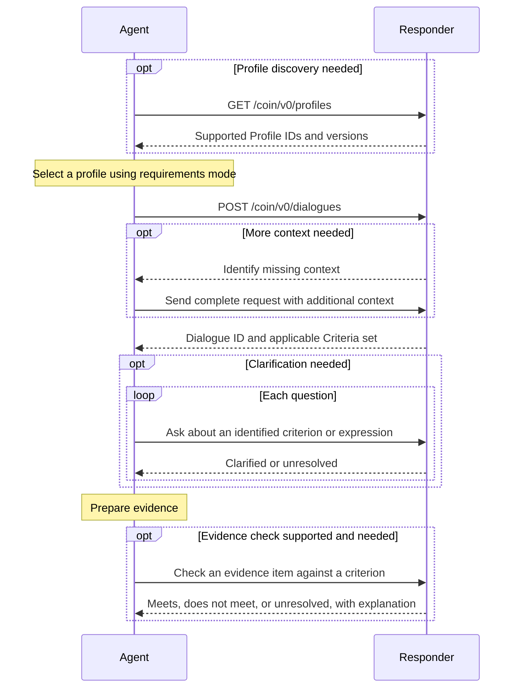

# Dialogue

Dialogue provides a bounded conversation for exchanging and clarifying
information. A mode defines the conversation's purpose, behavior, and
response structure.

This proposal currently defines only `requirements` mode for obtaining and
understanding evaluation requirements. A possible
[inquiry mode](#alternative-inquiry-mode-for-discussion) remains open for
community feedback.

In `requirements` mode, an [Agent](../agent/index.md) identifies the evaluation,
receives the applicable requirements as [Criteria](../criteria/index.md), and
can ask follow-up questions about their meaning.
An optional evidence check provides preliminary feedback on whether a supplied
item meets a requirement, as an alternative to asking a clarification question.

The conversation follows a simple REST API. Structured requests identify the
evaluation and the requirements being discussed; plain-language questions and
answers explain their meaning. Each exchange has a defined purpose and outcome.

## Roles

The [Agent](../agent/index.md) and Responder participate in `requirements` mode.
Dialogue defines their exchanges. The Agent specification defines the
agent's common evidence preparation behavior, findings, and record to support
audit and traceability, review and correction, testing and benchmarking, and use
of findings in the workflow.

| Protocol role | Responsibility |
| --- | --- |
| Agent | Acts for the Preparing Party. It selects a supported [Profile](../profile/index.md), requests applicable evaluation requirements, and asks for clarification or supported evidence checks when needed. It uses the exchanges to prepare evidence and findings for its assigned task. |
| Responder | The service that answers Dialogue requests on behalf of the Evaluator. It advertises the [Profiles](../profile/index.md) it supports, returns applicable requirements, handles clarification requests, and performs evidence checks when supported. |

The protocol roles act for participants in the broader workflow:

| Workflow participant | Responsibility |
| --- | --- |
| Preparing Party | Authorizes the Agent's task and its access to data and evidence. For example, a provider preparing a prior authorization request or quality report. |
| Evaluator | Is responsible for the evaluation and for identifying the requirements that apply. For example, a payer or quality reporting program. |

An organization may fulfill more than one role. The applicable
[Profile](../profile/index.md) identifies the participants, the agent's task,
and the review and handoff steps in the broader workflow.

An AI agent is preferred for the Responder because it can interpret questions
and explain evaluation requirements. AI is not required. Conventional software
or a service supported by human reviewers can fulfill the same role. Every
Responder follows the same protocol and reports when it cannot resolve a question.

The Evaluator may operate the Responder or authorize a delegate to operate it.
Responses identify both roles so the Agent can distinguish the service
answering a question from the organization responsible for the requirements.
The author of a policy or measure may be another organization; identifying that
source does not make its author the Evaluator.

## Tutorial: from an evaluation to clarified requirements

This tutorial uses `requirements` mode. Consider a provider preparing a prior
authorization request for fictional service X. The provider is the Preparing
Party, its agent is the Agent, and the payer is the Evaluator. The payer's
service is the Responder. This example uses the hypothetical requirements in the
[Criteria tutorial](../criteria/index.md#tutorial-from-a-requirement-to-a-criteria-set).
[Profile](../profile/index.md) identifiers, organizations, dates, and context
fields are illustrative.



### Step 0. Discover supported Profiles (optional)

The Agent can retrieve the
[Profiles](../profile/index.md) and
versions supported by the Responder. This step can be skipped when a supported
profile and version are already known through prior discovery or configuration.
The request has no body.

```text
GET /coin/v0/profiles
Accept: application/json
```

The Responder returns `200 OK` with a JSON array of
[profile references](#field-conventions).

```json
[
  {
    "id": "https://example.org/coin/profiles/prior-authorization",
    "version": "draft"
  },
  {
    "id": "https://example.org/coin/profiles/quality-measurement",
    "version": "draft"
  }
]
```

The Agent selects a listed profile version it supports that applies to its
task. The profile definition supplies the mode and context fields; it is
obtained separately or already known to the Agent. Here, the Agent
selects the illustrative prior authorization profile, whose
[JSON definition](../profile/index.md#profile-definition-and-selection) sets `dialogue.mode`
to `requirements`.

### Step 1. Start a dialogue

The Agent includes the selected
[Profile](../profile/index.md) ID and version in the
request's `profile` field and supplies the context defined by that profile. The
referenced profile selects the mode, so the request has no separate mode field.
In this example, the profile requires a service and requested date initially and
permits the Responder to request a plan when needed to select the requirements.
The Agent starts without sending a plan or a clinical record.

```text
POST /coin/v0/dialogues
Content-Type: application/json
```

```json
{
  "profile": {
    "id": "https://example.org/coin/profiles/prior-authorization",
    "version": "draft"
  },
  "context": {
    "service": "service-x",
    "requestedDate": "2026-09-16"
  }
}
```

The Responder finds that the applicable requirements depend on the plan. It
returns `needs-context`, identifying the missing field and explaining why it is
needed.

```json
{
  "outcome": "needs-context",
  "neededContext": [
    {
      "field": "/plan",
      "reason": "Requirements for service-x vary by plan. Supply the plan identifier to select the applicable policy."
    }
  ]
}
```

The `field` value is a JSON Pointer relative to the request's `context` object.
The Agent obtains the plan identifier and sends a complete request to the
same endpoint with the additional context included.

```json
{
  "profile": {
    "id": "https://example.org/coin/profiles/prior-authorization",
    "version": "draft"
  },
  "context": {
    "service": "service-x",
    "plan": "example-plan",
    "requestedDate": "2026-09-16"
  }
}
```

### Step 2. Receive the applicable requirements

The Responder returns `matched` when it identifies the applicable requirements.
The response records who supplied them, whose evaluation they support, and their
scope. The requirements are supplied as a
[Criteria](../criteria/index.md) set.

```json
{
  "outcome": "matched",
  "response": {
    "id": "ed73c3a5-78e1-4d1f-8232-9021207b4b99",
    "issuedAt": "2026-09-16T14:00:00Z",
    "responder": {
      "id": "https://example.org/services/criteria",
      "name": "Example Criteria Service"
    },
    "evaluator": {
      "id": "https://example.org/payer",
      "name": "Example Payer"
    },
    "scope": "Service X under Example Plan for the requested date.",
    "requirements": {
      "format": "coin-criteria",
      "content": {
        "id": "tutorial-authorization",
        "metadata": {
          "version": "draft",
          "title": "Authorization of service X",
          "source": "Hypothetical requirement for this tutorial"
        },
        "criteria": [
          {
            "id": "diagnosis",
            "statement": "The patient has diagnosis A."
          },
          {
            "id": "treatment-unsuccessful",
            "statement": "Previous treatment B for the patient was unsuccessful."
          },
          {
            "id": "treatment-unsuitable",
            "statement": "There is a documented reason that treatment B is unsuitable for the patient."
          }
        ],
        "expressions": [
          {
            "id": "treatment-requirement",
            "operator": "any",
            "operands": ["treatment-unsuccessful", "treatment-unsuitable"]
          },
          {
            "id": "eligibility",
            "operator": "all",
            "operands": ["diagnosis", "treatment-requirement"]
          }
        ],
        "result": "eligibility"
      }
    }
  }
}
```

Every matched response supplies a dialogue ID in `response.id`.
It identifies the dialogue's fixed profile, evaluation context, and initial result.
Within `requirements.content`, `id` and `metadata.version` identify the reusable
criteria set. A later dialogue can return the same criteria set under a different
dialogue ID.

### Step 3. Ask about a specific requirement

Suppose treatment B was stopped because of adverse effects before its
effectiveness could be assessed. The Agent needs to know whether documented
intolerance can support `treatment-unsuitable`, or whether "unsuitable" means
only a contraindication to starting treatment. That distinction determines which
evidence to gather. The logical relationships among the criteria do not resolve
the meaning of this term.

The dialogue ID in the path identifies the exact criteria set, version, and
evaluation context that the Responder returned. The request body identifies
the criterion being discussed and asks the question.

```text
POST /coin/v0/dialogues/ed73c3a5-78e1-4d1f-8232-9021207b4b99/clarify
Content-Type: application/json
```

```json
{
  "targetId": "treatment-unsuitable",
  "question": "Can documented intolerance of treatment B support this criterion when treatment was stopped before its effectiveness could be assessed, or is a contraindication to starting treatment required?"
}
```

For this hypothetical exchange, suppose the Evaluator has an established
interpretation of "unsuitable" that includes intolerance preventing continued
treatment. The Responder supplies that interpretation on the Evaluator's
authority.

```json
{
  "outcome": "clarified",
  "explanation": "For this policy, unsuitable includes inability to continue treatment because of intolerance. Documentation explaining why treatment B could not be continued can support this criterion even if its effectiveness was not assessed. A contraindication to starting treatment is not the only qualifying reason."
}
```

The Agent can now look for documentation of why treatment was stopped,
without treating an unassessed treatment response as evidence of lack of
effectiveness. The answer explains what evidence could support the criterion;
it does not determine whether a particular record satisfies it.

A further question can test the boundary of that interpretation. The Agent
sends another request to the same endpoint, with enough detail to stand alone.

```json
{
  "targetId": "treatment-unsuitable",
  "question": "Does a temporary interruption of treatment B because of adverse effects qualify as unsuitable when a retry at a lower dose is still planned?"
}
```

Suppose the source and the Evaluator's established interpretations do not
address temporary interruptions with a planned retry. The Responder reports
`unresolved` instead of assuming that every interruption makes treatment
unsuitable.

```json
{
  "outcome": "unresolved",
  "explanation": "The available policy and established interpretations do not specify whether a temporary interruption with a planned retry qualifies as unsuitable. Refer the question to the Evaluator's policy review process."
}
```

The Agent retains these exchanges for review, following the
[record retention rules](#identifiers-and-versions).
An unresolved clarification question remains visible in evidence preparation
and review. Its protocol outcome is distinct from a finding produced by
assessing evidence against a requirement.

Clarification explains existing requirements. Changes require a
[new criteria set version](#clarification).

### Step 4. Check an evidence item (optional)

The Agent finds a note saying treatment B was discontinued and asks whether
it meets `treatment-unsuitable`. Suppose the Responder supports evidence checks
and the [Profile](../profile/index.md) accepts FHIR
R4 [Composition](https://hl7.org/fhir/R4/composition.html) resources.

```text
POST /coin/v0/dialogues/ed73c3a5-78e1-4d1f-8232-9021207b4b99/check
Content-Type: application/json
```

```json
{
  "targetId": "treatment-unsuitable",
  "evidence": {
    "format": "application/fhir+json",
    "content": {
      "resourceType": "Composition",
      "status": "final",
      "type": { "text": "Progress note" },
      "subject": { "reference": "Patient/example" },
      "date": "2026-09-16T10:00:00Z",
      "author": [{ "reference": "Practitioner/example" }],
      "title": "Treatment follow-up",
      "section": [
        {
          "text": {
            "status": "additional",
            "div": "<div xmlns=\"http://www.w3.org/1999/xhtml\">Treatment B was discontinued for the patient.</div>"
          }
        }
      ]
    }
  }
}
```

The Responder identifies what is missing.

```json
{
  "outcome": "does-not-meet",
  "explanation": "The note gives no reason that treatment B is unsuitable. The criterion requires a documented reason."
}
```

The Agent can use this feedback to seek documentation explaining why
treatment was stopped. A qualifying item receives `meets`; an inconclusive
check receives `unresolved`. This is preliminary guidance for preparing evidence.
Final determination is made during submission.

## Protocol reference

This section defines the proposed protocol, with `requirements` as the only
currently defined mode. These are proposed rules subject to revision.

### Interactions

- [Supported Profiles](#supported-profiles)
- [Start a dialogue](#start-a-dialogue)
- [Clarification](#clarification)
- [Evidence check](#evidence-check)
- [HTTP binding](#http-binding)

### Data and rules

- [Field conventions](#field-conventions)
- [Evaluation requirements](#evaluation-requirements)
- [Identifiers and versions](#identifiers-and-versions)
- [Security](#security)

### Field conventions

Request and response bodies use JSON objects, except for the
[supported profiles response](#supported-profiles), which is an array of
profile references. Field names and identifier values are case-sensitive.
Required fields must be present; unused optional fields are omitted. `null` and
repeated field names are not allowed. Only listed fields are allowed, except
within `context`, `requirements.content`, and `evidence.content`, which follow
the rules below. Strings must be nonempty. Timestamps use RFC 3339 with a
timezone. These conventions apply to protocol objects; the
[Profile](../profile/index.md) governs the fields
and values within `context` and the accepted formats for `evidence.content`. The
fields and values within `requirements.content` follow
[Criteria](../criteria/index.md).

A [Profile](../profile/index.md) reference has
required string fields `id` and `version`. These identify a profile definition.
A `Participant` has a required string field `id` and an optional string field
`name` for display. The `id` is a stable URI identifying the service or
organization. These identifiers name participants; authorization establishes
whether a service may act for them.

### Supported Profiles

`GET /coin/v0/profiles` returns the supported
[Profile](../profile/index.md) versions
available to the authenticated Agent. The operation takes no query
parameters or request body.

Calling this endpoint is optional. The Agent may use a supported profile
version already known through prior discovery or configuration.

The Responder returns `200 OK` with a JSON array. Each entry is a
[profile reference](#field-conventions) containing only the required string
fields `id` and `version`. Each ID and version pair appears at most once.
Multiple versions of the same profile appear as separate entries. Array order
does not indicate preference or a default selection.

The response contains the complete list available to that Agent; pagination
is not used. An empty array means no supported profiles are available to that
Agent. A processing failure is an HTTP error, not an empty list.

The endpoint lists identifiers and versions.
[Profile](../profile/index.md) definitions are obtained
separately and specify their purpose, mode, context fields, and workflow rules.
The Agent selects a listed profile version it can use for the intended task.
If none is suitable, it cannot start a dialogue under this API.

The Agent records that selection in the `profile` field when starting a
dialogue. This selects an advertised profile version; it does not define a new
profile or override its requirements. The Responder verifies that the selection
is applicable to the requested evaluation and permitted for the Preparing Party.
Advertising support does not itself grant permission to use a profile.

### Start a dialogue

`POST /coin/v0/dialogues` starts a dialogue under the selected
[Profile](../profile/index.md) and accepts these
fields:

| Field | Type | Required | Meaning |
| --- | --- | --- | --- |
| `profile` | [Profile](../profile/index.md) reference | Yes | The profile and version selected from those advertised by the Responder. |
| `context` | object | Yes | Information defined by the [Profile](../profile/index.md) to identify the evaluation, including the relevant date or period. |

The Responder uses `dialogue.mode` from the referenced profile to determine the
interaction's behavior and response structure. The request contains only the
profile reference and context. Currently, only `requirements` mode is defined.

In `requirements` mode, evaluation requirements use
[Criteria](../criteria/index.md). The Agent does not
negotiate a different format through free text or an HTTP `Accept` header. An
unsupported profile or version is an error, not permission to substitute another
profile or requirements format.

For `requirements` mode, the reply always contains the string field `outcome`.
The following fields apply to each outcome and are otherwise omitted:

| Outcome | Meaning | Additional fields |
| --- | --- | --- |
| `matched` | The Responder identified requirements applicable within the profile's defined scope. | Required `response`: a [Matched response](#matched-response). |
| `needs-context` | Additional identifying context could resolve the requirements request. | Required `neededContext`: an array of one or more objects with string fields `field` and `reason`. `field` is a JSON Pointer within `context`, such as `/plan`. |
| `not-found` | The Responder could not identify applicable requirements. | Required `explanation`: a string describing the limitation. |

Only `matched` starts a dialogue and supplies its ID in `response.id`.
`needs-context` and `not-found` do not create a dialogue or issue an ID.

For `needs-context`, requested fields must be permitted by the
[Profile](../profile/index.md). The profile
distinguishes context required on the initial request from context that can be
requested later. The Agent sends a complete request with the additional
context. The Responder must not guess which requirements apply or interpret
`not-found` as an absence of requirements. An internal processing failure is an
HTTP error, not a `not-found` outcome.

[Step 1](#step-1-start-a-dialogue) shows a `needs-context` exchange.

If the Responder cannot provide applicable requirements for the supplied context
and authorized scope, it can return `not-found`. This outcome does not establish
that the evaluation has no requirements.

```json
{
  "outcome": "not-found",
  "explanation": "This service has no requirements for service-x under Example Plan on 2026-09-16. Contact the Evaluator to obtain the applicable requirements."
}
```

#### Matched response

| Field | Type | Required | Meaning |
| --- | --- | --- | --- |
| `id` | string | Yes | Responder-assigned dialogue ID, used as `dialogueId` in follow-up paths. It identifies the fixed profile, context, and initial result. |
| `issuedAt` | string (RFC 3339) | Yes | When the response was issued. |
| `expiresAt` | string (RFC 3339) | No | When the Agent must obtain a fresh requirements response before further use. |
| `responder` | Participant | Yes | The service supplying the response. |
| `evaluator` | Participant | Yes | The organization responsible for the applicable evaluation requirements. |
| `scope` | string | Yes | What the requirements cover for the requested evaluation, including known limitations. |
| `requirements` | [Requirements](#evaluation-requirements) | Yes | The applicable requirements represented as [Criteria](../criteria/index.md). |

The dialogue is bound to the request's
[Profile](../profile/index.md) and version, its
selected mode, the context, and the authorized Preparing Party. The Responder
selects the requirements applicable to the requested date or period, which may
differ from the newest published revision. `matched` identifies applicable
requirements; it does not assert that every requirement in the broader workflow
has been disclosed. The profile establishes the required coverage, and `scope`
must make any limitation explicit.

The optional `expiresAt` is a timestamp. At or after this time, the Agent must
obtain a fresh requirements response before continuing to rely on the result.
When omitted, the Responder supplies no explicit expiration time. Expiration does
not change the requirements' effective dates or the retention of the original exchange.

### Evaluation requirements

A `Requirements` object carries the evaluation requirements as
[Criteria](../criteria/index.md).

| Field | Type | Required | Meaning |
| --- | --- | --- | --- |
| `format` | string | Yes | Must be `coin-criteria`. |
| `content` | object | Yes | A complete [Criteria](../criteria/index.md) set. |

The `content` object is a complete
[criteria set](../criteria/index.md#criteria-set-structure). Its identifier, revision,
and source are supplied by `content.id`, `content.metadata.version`, and
`content.metadata.source`.

### Clarification

```text
POST /coin/v0/dialogues/{dialogueId}/clarify
```

Clarification asks about a previously returned criteria set.
Agents and Responders must support this operation, although a question need
not be asked and a substantive answer cannot always be supplied.

| Request field | Type | Required | Meaning |
| --- | --- | --- | --- |
| `targetId` | string | Yes | ID of one criterion or expression in that set. |
| `question` | string | Yes | A question about that target's meaning, relationships, or evidence requirements. |

The dialogue reference fixes the criteria set, version,
[Profile](../profile/index.md), and evaluation
context. The request does not repeat the set's identifier or version. The
Responder checks access to that dialogue and validates `targetId` against its
criteria set. It must not reinterpret the target against a newer criteria set.
Each question must supply enough detail to stand on its own; the protocol does
not assume an implicit chat history. The Agent can quote an earlier
explanation when asking a follow-up question.

Every processed clarification reply contains string fields `outcome` and
`explanation`.
The `explanation` provides the answer, any limitations, and recommended follow-up
when available.

The reply does not repeat the dialogue reference or target. See
[Identifiers and versions](#identifiers-and-versions) for record retention.

| Outcome | Meaning |
| --- | --- |
| `clarified` | The Responder supplies an explanation supported by the applicable requirements and the Evaluator's authority. |
| `unresolved` | The Responder cannot resolve the question. The explanation identifies the gap or limitation and describes a review or follow-up process when available. |

A clarification explains the existing requirements. It must not add a
threshold, waive a condition, override a binding or expression, or promise an
evaluation result. A change to the requirements must be published as a new
criteria set version. If answering a question would require changing the
supplied requirements, the outcome is `unresolved`.

The working proposal treats `clarified` as an interpretation supplied on the
Evaluator's authority that the Preparing Party can rely on within the stated
scope. This does not determine whether a particular patient's evidence meets
the criterion. The effect of that reliance in the broader evaluation workflow
remains open for community input.

### Evidence check

```text
POST /coin/v0/dialogues/{dialogueId}/check
```

An evidence check provides preliminary feedback on whether supplied evidence
meets one criterion in a previously returned
[Criteria](../criteria/index.md) set. It is an
alternative to asking a clarification question when the Agent has a concrete
item, such as a FHIR resource, to check. Support is optional; a
[Profile](../profile/index.md) may require support
or use of the operation.

| Request field | Type | Required | Meaning |
| --- | --- | --- | --- |
| `targetId` | string | Yes | ID of one criterion in the referenced criteria set. |
| `evidence` | object | Yes | The supplied evidence item, with the fields defined below. |

The dialogue reference and access checks follow the clarification operation.
Each request stands on its own and uses the referenced requirements and evaluation
context.

The `evidence` object contains these fields:

| Field | Type | Required | Meaning |
| --- | --- | --- | --- |
| `format` | string | Yes | Media type of the supplied content, such as `application/fhir+json` or `text/plain`. |
| `content` | object or string | Yes | The evidence itself. JSON content is embedded as an object; plain text is supplied as a string. |

For [FHIR JSON](https://hl7.org/fhir/R4/http.html#mime-type), use
`application/fhir+json` and supply the FHIR resource object in `content`, as
shown in [Step 4](#step-4-check-an-evidence-item-optional). The profile
specifies accepted media types, format versions, and any required FHIR profiles.

Every processed reply contains string fields `outcome` and `explanation`.

| Outcome | Meaning |
| --- | --- |
| `meets` | The supplied evidence meets the criterion in the stated context. |
| `does-not-meet` | The supplied evidence does not meet the criterion. The explanation identifies why. |
| `unresolved` | The Responder cannot determine whether the evidence meets the criterion and explains the limitation. |

The reply is preliminary guidance for preparing evidence. Final determination
is made during submission under the surrounding workflow. A negative check
concerns the supplied item; another item may meet the requirement.

For a hypothetical quality measure requiring an encounter during the reporting
period, a check could similarly flag a FHIR resource's encounter date as outside
that period.

### Identifiers and versions

Every matched requirements response requires a Responder-assigned dialogue ID
in `response.id`. The ID must be unique within the Responder's service and
identify the immutable initial request and response. The profile and version,
mode, context, and initial requirements remain fixed for that dialogue. A change
to those inputs requires a new dialogue. The ID allows later questions and
evidence checks to refer to the original result. Each follow-up request stands
on its own.

Within the Evaluator's namespace, a requirements identifier and revision must
identify unchanged content. These are `content.id` and
`content.metadata.version`. A revision receives a new version; reordering entries
must not reassign their IDs. An existing ID must not be repurposed for an
unrelated requirement.
Criterion and expression IDs are local to their criteria set. In clarification
requests, the dialogue reference establishes that set and its version, while
`targetId` selects the entry within it.

The Agent retains the initial request, response, questions, and answers
together for review and links them to findings in the record defined by
[Agent](../agent/index.md#common-agent-record). The Responder retains the
original request and response, including the associated Preparing Party, so it
can resolve clarification
targets and check authorization for the retention period defined by the
[Profile](../profile/index.md). After that period,
it reports the reference as unavailable rather than silently using a current
version.

Retrying a request does not guarantee identical generated wording.

### HTTP binding

The four operations use JSON over HTTPS. Requests with a body and all JSON
responses use `Content-Type: application/json`. Paths use `/coin/v0` relative to
the configured service origin. `v0` identifies the provisional API and may
introduce incompatible changes as the proposal develops. API versions are
independent of
[Profile](../profile/index.md) and
requirements versions. The proposed protocol uses synchronous replies; it does
not require streaming, callbacks, or asynchronous jobs. Human review can be a
next step following `unresolved`.

| HTTP status | Use |
| --- | --- |
| `200 OK` | A supported [Profiles](../profile/index.md) array, or a processed request to start a dialogue, clarify a requirement, or check evidence, including a negative or unresolved application outcome. |
| `400 Bad Request` | Invalid JSON, invalid fields or references, or an unsupported [Profile](../profile/index.md) or version. |
| `401 Unauthorized` | Missing or invalid access token. |
| `403 Forbidden` | The authenticated client lacks permission for the operation or requested context. |
| `404 Not Found` | The referenced dialogue is unavailable. This may also conceal a dialogue the client is not authorized to access. |

Error bodies contain string fields `code` and `message`.
Proposed codes include `invalid-request`,
`unsupported-profile`, `invalid-target`, and `check-unavailable`;
the complete error vocabulary remains to be defined. Errors must not expose
another party's context or protected content.

An unsupported evidence-check operation returns `400 Bad Request` with
`check-unavailable`. A negative or unresolved check is a processed outcome.

## Requirements disclosure and maintenance

The initial response may not fully express every detail needed to understand
the applicable evaluation requirements. Intellectual property or licensing
restrictions may limit distribution of underlying policy material or decision
logic, and some questions about interpretation emerge only in a particular
context. Dialogue provides a way for the Agent to obtain authorized
explanations of identified requirements. The Responder must make limitations in
the supplied requirements explicit, and applicable disclosure obligations still
apply.

Clarification exchanges can also help improve the criteria set supplied upfront.
Responders and their Evaluators are encouraged to review recurring questions
and unresolved cases to identify ambiguous language, missing explanations, and
issues requiring an authoritative decision. These observations can inform clearer
statements, examples, and future criteria set revisions, subject to applicable
privacy and data-use requirements. This specification does not define that
review and maintenance process.

## Security

HTTPS and OAuth 2.0 are proposed basics for protecting exchanges and authorizing
access. Access should be limited to the operations and evaluation contexts
permitted for the Preparing Party. Requests and retained records should contain
only the sensitive information needed for the task.

The detailed security approach is deferred to community input. Topics include
client authentication, permissions, trust establishment, and whether patterns
from SMART Backend Services provide a suitable basis for Dialogue.

## Alternative inquiry mode for discussion

In the `requirements` mode defined above, a participant obtains
the applicable evaluation requirements, clarifies their meaning, and uses them
to prepare relevant evidence. Making the requirements available gives that
participant a basis for understanding the evaluation and deciding what
information to gather.

An alternative inquiry mode could begin with one participant supplying the
context for a task. The other participant's agent would then guide the
conversation by asking questions and requesting facts or evidence. This mode
would not supply evaluation requirements upfront or use
[Criteria](../criteria/index.md). The participant holding the relevant
information would search authorized sources and return supported answers, with
source references and limitations. Either side could ask for clarification or
follow up on the evidence as the exchange develops.

In prior authorization, for example, a provider's agent could start a dialogue
by giving the payer's agent context about the requested service. The payer's
agent could then ask, "What treatments have already been tried?" The provider's
agent could return a supported answer or explain what is unavailable. The
payer's agent could follow up with, "Show the documentation explaining why
treatment B was stopped." The provider's agent could ask for clarification and
supply relevant evidence. The conversation would go back and forth as both
sides clarify what is needed, examine evidence, and identify what remains
unresolved.

Inquiry mode is not defined by the current protocol. Its protocol roles, response
structure, and follow-up operations remain open for discussion.

This mode could support focused information exchange when the questions needed
to complete a task emerge during the workflow and are difficult to anticipate in
advance. A [Profile](../profile/index.md) would select one mode for the
workflow and establish its scope, permissions, outputs, and review
responsibilities. The inquiry could then develop within those bounds while
keeping answers traceable to their supporting information.

Community feedback is invited on whether this alternative mode should be explored
further and which clinical or operational use cases could benefit from it.
