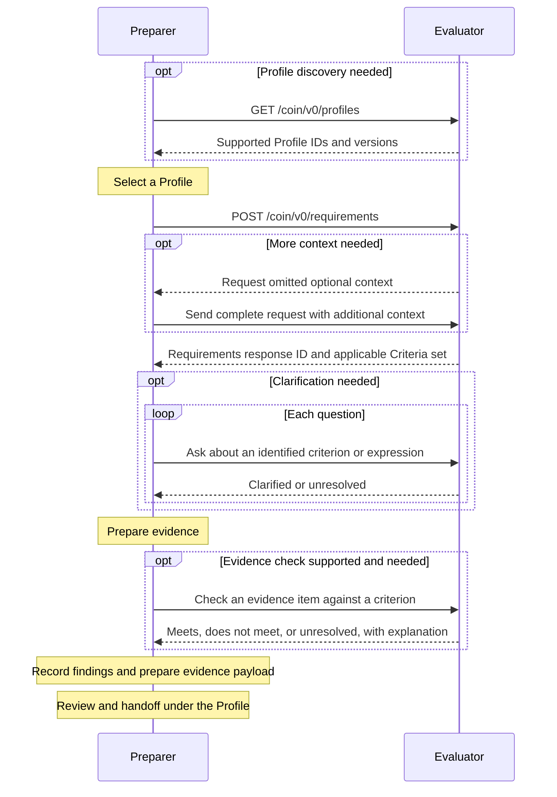

# Disclosure

Disclosure is an interaction model in which one participant supplies its
evaluation requirements upfront as [Criteria](../criteria/index.md), so another
participant can prepare the data and evidence needed for the evaluation. An
agent gathers and assesses evidence against those requirements, asks for
clarification when needed, and records findings for review.

## Roles

The Preparing Party prepares information for an evaluation and authorizes the
task and access to data. The Evaluating Party is responsible for the evaluation
and its applicable requirements. The Preparer and Evaluator act for these
participants.

| Role | Acts for | Responsibility |
| --- | --- | --- |
| [Preparer](#preparer) | Preparing Party | An AI agent that gathers and assesses evidence, seeks clarification, and records findings. |
| [Evaluator](#evaluator) | Evaluating Party | A service, preferably implemented as an AI agent, that supplies requirements, explains their meaning, and checks evidence when supported. |

The Evaluator is preferably implemented as an AI agent. At this stage, the
proposal also permits other approaches, such as conventional software or services
supported by human reviewers.

The Evaluating Party may operate the Evaluator or authorize a delegate. Responses
identify both the service and the Evaluating Party, which may differ from the
organization that authored the underlying policy or measure. An organization may
fulfill more than one role.

## Responsibilities and outputs

Both participants make their [Activity Records](../activity-record/index.md)
available to authorized reviewers under the [Profile](../profile/index.md)'s
access and delivery rules.

### Preparer

The Preparer's responsibilities cover the full preparation task, including work
outside exchanges with the Evaluator. It establishes its assignment and
permissions under the selected Profile and version, and acts within those limits.
Retrieved records, documents, and tool responses provide information for the task;
they do not grant additional authority or change the assignment.

The Preparer:

- Obtains applicable Criteria using the Profile's context and asks for
  clarification when requirements or evidence expectations are unclear.
- Searches authorized sources and preserves supporting and conflicting
  information, including the subject, event, timing, and other relevant context.
  Combined evidence must concern the same subject or event when required.
- Links evidence to the Criteria set and version, the criterion or expression it
  addresses, and an inspectable source location. It distinguishes source
  information from interpretations, summaries, mappings, and calculations,
  retaining enough explanation to review their use.
- Assesses assigned criteria and expressions using the
  [Criteria interpretation rules](../criteria/index.md#operator-meaning). Each
  finding identifies the assessed entry, supporting evidence, and explanation.
  Entries not assessed remain distinguishable from assessed entries.
- Maintains an Activity Record of its actions, exchanges, findings, and unresolved
  issues, with links to supporting sources and the evidence payload.
- Prepares the evidence payload for review and handoff within the broader
  workflow, using the formats and standards required by the Profile.

The Profile identifies the criteria and expressions assigned for assessment
and establishes when data collection is ready for that assessment. It can require
a [Criteria `result` reference](../criteria/index.md#result) when the
workflow needs a single overall finding.

Completion of the preparation task is distinct from satisfaction of the
requirements. A completed task can contain unresolved findings.

#### Uncertainty and incomplete work

The Preparer reports missing context, unsupported inputs, unclear requirements,
and conflicting evidence, explaining any resolution or remaining uncertainty.
It records what information was sought and which sources were searched,
distinguishing a completed search with no matching records from failed or
unfinished retrieval. Missing evidence is interpreted according to the
requirement and its source rules.

Unanswered questions remain visible for review. The Preparer must not invent
requirements or supporting facts to resolve them. It follows the Profile's
conditions for seeking additional information, continuing with partial results,
stopping, or returning work for review. When requirements change or a
[requirements response expires](#matched-response), it follows the Profile's
process for reviewing affected evidence and findings. It preserves the versions
used for earlier findings.

#### Outputs and review

The Preparer prepares two related outputs:

| Output | Purpose |
| --- | --- |
| Evidence payload | Contains the data and supporting information prepared for the assigned task, in the format required by the Profile for review or handoff. |
| [Activity Record](../activity-record/index.md) | Documents preparation work for audit and transparency, linking findings to evidence, sources, exchanges, and relevant actions. |

The Preparer's Activity Record identifies the Criteria set and version, the
entries assigned for assessment, findings and unresolved issues, and related
clarification and evidence-check exchanges. It links findings to the relevant
content in the evidence payload.

The Preparer follows the Profile's checks, review, and correction process before
handoff. When work stops before a payload can be produced, the record identifies
the incomplete work and its limitations.

### Evaluator

The Evaluator follows the [protocol](#protocol-reference) to select and supply
applicable Criteria, clarify their meaning, and check evidence when supported.
It:

- Validates the selected Profile, evaluation context, and authorization, and
  selects requirements for the requested date or period.
- Identifies the scope and limitations of the requirements supplied. Failure to
  find requirements does not establish that an evaluation has no requirements.
- Explains requirements using their sources and the Evaluating Party's established
  interpretations. It reports unresolved questions when those sources do not
  provide an answer. Changes to requirements receive a new Criteria set version.
- Maintains an Activity Record that preserves original requirements and
  exchanges, links responses to supporting sources, and records unresolved issues.
- Checks access to later requests and distinguishes processing failures from
  negative or unresolved application outcomes.

Evidence checks provide preliminary guidance on an individual item. Final
determination takes place within the broader workflow defined by the Profile.

Restrictions on underlying policy material or decision logic may limit what the
Evaluator can supply. It provides authorized explanations and makes those
limitations explicit; applicable disclosure obligations still apply.

Evaluators and Evaluating Parties are encouraged to review recurring questions and
unresolved cases to improve future Criteria revisions. Revisions follow version
rules and applicable privacy and data-use requirements.

## Tutorial: from requirements to evidence

Consider a provider preparing a prior authorization request for fictional
service X. The provider is the Preparing Party, its agent is the Preparer,
and the payer is the Evaluating Party. The payer's service is the Evaluator.
This example uses the hypothetical requirements in the
[Criteria tutorial](../criteria/index.md#tutorial-from-a-requirement-to-a-criteria-set).
Profile identifiers, organizations, dates, and context
fields are illustrative.



### Step 0. Discover supported Profiles (optional)

The Preparer can check which [Profiles](../profile/index.md) and versions
the Evaluator supports, then use a version its own implementation supports.
This step can be skipped when shared support is already known through prior
discovery or configuration. The request has no body.

```text
GET /coin/v0/profiles
Accept: application/json
```

The Evaluator returns `200 OK` with a JSON array of
[Profile references](#field-conventions).

```json
[
  {
    "id": "https://example.org/coin/profiles/prior-authorization",
    "version": "draft"
  },
  {
    "id": "https://example.org/coin/profiles/quality-measurement",
    "version": "draft"
  }
]
```

The Preparer selects a listed Profile version that its implementation supports
and that applies to its task. In this example, both participants support the
illustrative prior authorization Profile, which specifies Disclosure and
defines the evaluation context.

### Step 1. Request requirements

The Preparer includes the selected
[Profile](../profile/index.md) ID and version in the
request's `profile` field and supplies the context defined by that Profile.
In this example, the Profile defines service and requested date as required
context and plan as optional context. The Preparer could include the plan in
the initial request but omits it here. No clinical record is sent.

```text
POST /coin/v0/requirements
Content-Type: application/json
```

```json
{
  "profile": {
    "id": "https://example.org/coin/profiles/prior-authorization",
    "version": "draft"
  },
  "context": {
    "service": "service-x",
    "requestedDate": "2026-09-16"
  }
}
```

The Evaluator finds that the applicable requirements depend on the plan. It
returns `needs-context`, identifying the omitted optional field and explaining
why it is needed for this evaluation.

```json
{
  "outcome": "needs-context",
  "neededContext": [
    {
      "field": "/plan",
      "reason": "Requirements for service-x vary by plan. Supply the plan identifier to select the applicable policy."
    }
  ]
}
```

The `field` value is a JSON Pointer relative to the request's `context` object.
The Preparer obtains the plan identifier and sends a complete request to the
same endpoint with the additional context included.

```json
{
  "profile": {
    "id": "https://example.org/coin/profiles/prior-authorization",
    "version": "draft"
  },
  "context": {
    "service": "service-x",
    "plan": "example-plan",
    "requestedDate": "2026-09-16"
  }
}
```

### Step 2. Receive the applicable requirements

The Evaluator returns `matched` when it identifies the applicable requirements.
The response records who supplied them, whose evaluation they support, and their
scope. The requirements are supplied as a
[Criteria](../criteria/index.md) set.

```json
{
  "outcome": "matched",
  "response": {
    "id": "ed73c3a5-78e1-4d1f-8232-9021207b4b99",
    "issuedAt": "2026-09-16T14:00:00Z",
    "evaluator": {
      "id": "https://example.org/services/criteria",
      "name": "Example Criteria Service"
    },
    "evaluatingParty": {
      "id": "https://example.org/payer",
      "name": "Example Payer"
    },
    "scope": "Service X under Example Plan for the requested date.",
    "requirements": {
      "content": {
        "id": "tutorial-authorization",
        "metadata": {
          "version": "draft",
          "title": "Authorization of service X",
          "source": "Hypothetical requirement for this tutorial"
        },
        "criteria": [
          {
            "id": "diagnosis",
            "statement": "The patient has diagnosis A."
          },
          {
            "id": "treatment-unsuccessful",
            "statement": "Previous treatment B for the patient was unsuccessful."
          },
          {
            "id": "treatment-unsuitable",
            "statement": "There is a documented reason that treatment B is unsuitable for the patient."
          }
        ],
        "expressions": [
          {
            "id": "treatment-requirement",
            "operator": "any",
            "operands": ["treatment-unsuccessful", "treatment-unsuitable"]
          },
          {
            "id": "eligibility",
            "operator": "all",
            "operands": ["diagnosis", "treatment-requirement"]
          }
        ],
        "result": "eligibility"
      }
    }
  }
}
```

Each matched response has an ID in `response.id`. Follow-up clarification and
evidence-check requests use this ID to reference the original response and its
associated Profile, version, and evaluation context. Within `requirements.content`,
`id` and `metadata.version` identify the reusable Criteria set, which may appear in
multiple responses.

### Step 3. Ask about a specific requirement

Suppose treatment B was stopped because of adverse effects before its
effectiveness could be assessed. The Preparer needs to know whether documented
intolerance can support `treatment-unsuitable`, or whether "unsuitable" means
only a contraindication to starting treatment. That distinction determines which
evidence to gather. The logical relationships among the criteria do not resolve
the meaning of this term.

The requirements response ID in the path identifies the original response and
its associated Criteria set, version, and evaluation context. The request body
identifies the criterion being discussed and asks the question.

```text
POST /coin/v0/requirements/ed73c3a5-78e1-4d1f-8232-9021207b4b99/clarify
Content-Type: application/json
```

```json
{
  "targetId": "treatment-unsuitable",
  "question": "Can documented intolerance of treatment B support this criterion when treatment was stopped before its effectiveness could be assessed, or is a contraindication to starting treatment required?"
}
```

For this hypothetical exchange, suppose the Evaluating Party has an established
interpretation of "unsuitable" that includes intolerance preventing continued
treatment. The Evaluator supplies that interpretation on the Evaluating Party's
authority.

```json
{
  "outcome": "clarified",
  "explanation": "For this policy, unsuitable includes inability to continue treatment because of intolerance. Documentation explaining why treatment B could not be continued can support this criterion even if its effectiveness was not assessed. A contraindication to starting treatment is not the only qualifying reason."
}
```

The Preparer can now look for documentation of why treatment was stopped,
without treating an unassessed treatment response as evidence of lack of
effectiveness. The answer explains what evidence could support the criterion;
it does not determine whether a particular record satisfies it.

A further question can test the boundary of that interpretation. The Preparer
sends another request to the same endpoint, with enough detail to stand alone.

```json
{
  "targetId": "treatment-unsuitable",
  "question": "Does a temporary interruption of treatment B because of adverse effects qualify as unsuitable when a retry at a lower dose is still planned?"
}
```

Suppose the source and the Evaluating Party's established interpretations do not
address temporary interruptions with a planned retry. The Evaluator reports
`unresolved` instead of assuming that every interruption makes treatment
unsuitable.

```json
{
  "outcome": "unresolved",
  "explanation": "The available policy and established interpretations do not specify whether a temporary interruption with a planned retry qualifies as unsuitable. Refer the question to the Evaluating Party's policy review process."
}
```

An unresolved clarification question remains visible in evidence preparation
and review. Its protocol outcome is distinct from a finding produced by
assessing evidence against a requirement.

Clarification explains existing requirements. Changes require a
[new Criteria set version](#clarification).

### Step 4. Check an evidence item (optional)

The Preparer finds a note saying treatment B was discontinued and asks whether
it meets `treatment-unsuitable`. Suppose the Evaluator supports evidence checks
and the Profile accepts FHIR
R4 [Composition](https://hl7.org/fhir/R4/composition.html) resources.

```text
POST /coin/v0/requirements/ed73c3a5-78e1-4d1f-8232-9021207b4b99/check
Content-Type: application/json
```

```json
{
  "targetId": "treatment-unsuitable",
  "evidence": {
    "format": "application/fhir+json",
    "content": {
      "resourceType": "Composition",
      "status": "final",
      "type": { "text": "Progress note" },
      "subject": { "reference": "Patient/example" },
      "date": "2026-09-16T10:00:00Z",
      "author": [{ "reference": "Practitioner/example" }],
      "title": "Treatment follow-up",
      "section": [
        {
          "text": {
            "status": "additional",
            "div": "<div xmlns='http://www.w3.org/1999/xhtml'>Treatment B discontinued.</div>"
          }
        }
      ]
    }
  }
}
```

The Evaluator identifies what is missing.

```json
{
  "outcome": "does-not-meet",
  "explanation": "The note gives no reason that treatment B is unsuitable. The criterion requires a documented reason."
}
```

The Preparer can use this feedback to seek documentation explaining why
treatment was stopped. A qualifying item receives `meets`; an inconclusive
check receives `unresolved`. This is preliminary guidance for preparing evidence.
Final determination takes place within the broader workflow defined by the Profile.

### Step 5. Record findings and prepare the evidence payload

For the original intolerance case, suppose the Preparer finds a diagnosis record
and a fuller treatment note documenting that treatment B could not be continued
because of intolerance. It uses the clarification from Step 3 to assess the
requirements.

| Criterion | Illustrative finding and basis |
| --- | --- |
| `diagnosis` | Satisfied, supported by the record of diagnosis A. |
| `treatment-unsuccessful` | Unresolved, because the records do not establish treatment effectiveness. |
| `treatment-unsuitable` | Satisfied, supported by the documented intolerance and applicable clarification. |

The overall `eligibility` expression is satisfied because `diagnosis` and
`treatment-unsuitable` are satisfied. The
[Activity Record](../activity-record/index.md) documents the findings, sources, and
exchanges, including the unresolved finding about treatment effectiveness and
the separate clarification question about a planned retry.

The Preparer prepares the evidence payload in the Profile's required format and
links it to the findings and supporting sources in its Activity Record. It
follows the Profile's review and correction process before handoff for subsequent
workflow steps.

## Protocol reference

The Disclosure protocol uses a REST API with structured requests and
plain-language questions and explanations. The following sections define the
operations, message formats, and shared rules.

### Interactions

- [Supported Profiles](#supported-profiles)
- [Request requirements](#request-requirements)
- [Clarification](#clarification)
- [Evidence check](#evidence-check)
- [HTTP binding](#http-binding)

### Data and rules

- [Field conventions](#field-conventions)
- [Evaluation requirements](#evaluation-requirements)
- [Identifiers and versions](#identifiers-and-versions)
- [Security](#security)

### Field conventions

Request and response bodies use JSON objects, except for the
[supported Profiles response](#supported-profiles), which is an array of
Profile references. Field names and identifier values are case-sensitive.
Required fields must be present; unused optional fields are omitted. `null` and
repeated field names are not allowed. Only listed fields are allowed, except
within `context`, `requirements.content`, and `evidence.content`, which follow
the rules below. Strings must be nonempty. Timestamps use RFC 3339 in UTC with
the uppercase `Z` suffix, for example `2026-09-16T14:00:00Z`.
These conventions apply to protocol objects; the
[Profile](../profile/index.md) governs the fields
and values within `context` and the accepted media types and delivery options
for `evidence`. The fields and values within `requirements.content` follow
[Criteria](../criteria/index.md).

A Profile reference has required string fields `id` and `version`. These identify
a published Profile version.

A `Participant` has a required string field `id` and an optional string field
`name` for display. The `id` is a stable URI identifying the service or
organization. These identifiers name participants; authorization establishes
whether a service may act for them.

### Supported Profiles

`GET /coin/v0/profiles` returns the supported
[Profile](../profile/index.md) versions
available to the authenticated Preparer. The operation takes no query
parameters or request body.

Calling this endpoint is optional. The Preparer may use a supported Profile
version already known through prior discovery or configuration.

The Evaluator returns `200 OK` with a JSON array. Each entry is a
[Profile reference](#field-conventions) containing only the required string
fields `id` and `version`. Each ID and version pair appears at most once.
Multiple versions of the same Profile appear as separate entries. Array order
does not indicate preference or a default selection.

The response contains the complete list available to that Preparer; pagination
is not used. An empty array means no supported Profiles are available to that
Preparer. A processing failure is an HTTP error, not an empty list.

The Preparer compares the returned identifiers and versions with the Profiles
its implementation supports and selects one appropriate for its task. If no
applicable version is supported by both participants, it cannot request
requirements under this API.

The Preparer records that selection in the `profile` field when requesting
requirements. This selects an advertised Profile version; it does not define a new
Profile or override its requirements. The Evaluator verifies that the selection
is applicable to the requested evaluation and permitted for the Preparing Party.
Advertising support does not itself grant permission to use a Profile.

### Request requirements

`POST /coin/v0/requirements` requests applicable evaluation requirements under
the selected [Profile](../profile/index.md) and accepts these fields:

| Field | Type | Required | Meaning |
| --- | --- | --- | --- |
| `profile` | [Profile reference](#field-conventions) | Yes | The Profile and version selected from those advertised by the Evaluator. |
| `context` | object | Yes | Information defined by the Profile to identify the evaluation, including the relevant date or period. |

The Profile defines required and optional context fields. The Preparer must
include all required context fields in each requirements request and may also
include optional context fields. The Evaluator may request omitted optional
context when needed to identify the applicable requirements for the particular
evaluation.

The selected Profile must use Disclosure. The Evaluator validates the Profile
and version and verifies that the evaluation context is applicable and
authorized under its workflow rules.

Evaluation requirements use [Criteria](../criteria/index.md). The Preparer does
not negotiate a different format through free text or an HTTP `Accept` header.
An unsupported Profile or version is an error, not permission to substitute
another Profile or requirements format.

The reply always contains the string field `outcome`.
The following fields apply to each outcome and are otherwise omitted:

| Outcome | Meaning | Additional fields |
| --- | --- | --- |
| `matched` | The Evaluator identified requirements applicable within the Profile's defined scope. | Required `response`: a [Matched response](#matched-response). |
| `needs-context` | Optional context omitted from the request is needed to identify applicable requirements. | Required `neededContext`: an array of one or more objects with string fields `field` and `reason`. `field` is a JSON Pointer within `context`. |
| `not-found` | The Evaluator could not identify applicable requirements. | Required `explanation`: a string describing the limitation. |

Only `matched` includes the `response` object and its ID in `response.id`.
`needs-context` and `not-found` do not issue an ID for follow-up requests.

For `needs-context`, `neededContext` identifies omitted optional context fields
defined by the Profile and explains why they are needed for
this evaluation. The Preparer sends a complete requirements request with the
additional context. The Evaluator must not guess which requirements apply or
interpret `not-found` as an absence of requirements. An internal processing
failure is an HTTP error, not a `not-found` outcome.

[Step 1](#step-1-request-requirements) shows a `needs-context` exchange.

If the Evaluator cannot provide applicable requirements for the supplied context
and authorized scope, it can return `not-found`. This outcome does not establish
that the evaluation has no requirements.

```json
{
  "outcome": "not-found",
  "explanation": "This service has no requirements for service-x under Example Plan on 2026-09-16. Contact the Evaluating Party to obtain the applicable requirements."
}
```

#### Matched response

| Field | Type | Required | Meaning |
| --- | --- | --- | --- |
| `id` | string | Yes | Evaluator-assigned requirements response ID, used as `responseId` in follow-up paths. It identifies the original request and response, including the fixed Profile and version, evaluation context, and supplied requirements. |
| `issuedAt` | string (RFC 3339) | Yes | When the response was issued. |
| `expiresAt` | string (RFC 3339) | No | When the Preparer must obtain a fresh requirements response before further use. |
| `evaluator` | Participant | Yes | The Evaluator service supplying the response. |
| `evaluatingParty` | Participant | Yes | The Evaluating Party responsible for the applicable evaluation requirements. |
| `scope` | string | Yes | What the requirements cover for the requested evaluation, including known limitations. |
| `requirements` | [Requirements](#evaluation-requirements) | Yes | The applicable requirements represented as [Criteria](../criteria/index.md). |

The requirements response is bound to the request's
[Profile](../profile/index.md) and version, the context, and the authorized
Preparing Party. The Evaluator selects the requirements applicable to the
requested date or period, which may
differ from the newest published revision. `matched` identifies applicable
requirements; it does not assert that every requirement in the broader workflow
has been disclosed. The Profile establishes the required coverage, and `scope`
must make any limitation explicit.

The optional `expiresAt` is a timestamp. At or after this time, the Preparer must
obtain a fresh requirements response before continuing to rely on the result.
When omitted, the Evaluator supplies no explicit expiration time. Expiration does
not change the requirements' effective dates.

### Evaluation requirements

A `Requirements` object carries the evaluation requirements as Criteria.

| Field | Type | Required | Meaning |
| --- | --- | --- | --- |
| `content` | object | Yes | A complete Criteria set. |

The `content` object is a complete
[Criteria set](../criteria/index.md#criteria-set-structure). Its identifier, revision,
and source are supplied by `content.id`, `content.metadata.version`, and
`content.metadata.source`.

### Clarification

```text
POST /coin/v0/requirements/{responseId}/clarify
```

Clarification asks about a previously returned [Criteria](../criteria/index.md) set.
Preparers and Evaluators must support this operation, although a question need
not be asked and a substantive answer cannot always be supplied.

| Request field | Type | Required | Meaning |
| --- | --- | --- | --- |
| `targetId` | string | Yes | ID of one criterion or expression in that set. |
| `question` | string | Yes | A question about that target's meaning, relationships, or evidence requirements. |

The requirements response reference fixes the Criteria set, version,
[Profile](../profile/index.md), and evaluation context. The request does not repeat
the set's identifier or version. The Evaluator checks access to the referenced
response and validates `targetId` against its Criteria set. It must not reinterpret
the target against a newer Criteria set.
Each question must supply enough detail to stand on its own; the protocol does
not assume an implicit chat history. The Preparer can quote an earlier
explanation when asking a follow-up question.

Every processed clarification reply contains string fields `outcome` and
`explanation`.
The `explanation` provides the answer, any limitations, and recommended follow-up
when available.

The reply does not repeat the requirements response reference or target.

| Outcome | Meaning |
| --- | --- |
| `clarified` | The Evaluator supplies an explanation supported by the applicable requirements and the Evaluating Party's authority. |
| `unresolved` | The Evaluator cannot resolve the question. The explanation identifies the gap or limitation and describes a review or follow-up process when available. |

A clarification explains the existing requirements. It must not add a
threshold, waive a condition, override a binding or expression, or promise an
evaluation result. A change to the requirements must be published as a new
Criteria set version. If answering a question would require changing the
supplied requirements, the outcome is `unresolved`.

The working proposal treats `clarified` as an interpretation supplied on the
Evaluating Party's authority that the Preparing Party can rely on within the stated
scope. This does not determine whether a particular patient's evidence meets
the criterion. The effect of that reliance in the broader evaluation workflow
remains open for community input.

### Evidence check

```text
POST /coin/v0/requirements/{responseId}/check
```

An evidence check provides preliminary feedback on whether supplied evidence
meets one criterion in a previously returned
[Criteria](../criteria/index.md) set. It is an
alternative to asking a clarification question when the Preparer has a concrete
evidence item to check. Support is optional; a
[Profile](../profile/index.md) may require support
or use of the operation.

| Request field | Type | Required | Meaning |
| --- | --- | --- | --- |
| `targetId` | string | Yes | ID of one criterion in the referenced Criteria set. |
| `evidence` | object | Yes | The supplied evidence item, with the fields defined below. |

The requirements response reference and access checks follow the clarification
operation. Each request stands on its own and uses the referenced requirements
and evaluation context.

#### Supplying evidence

Evidence may be supplied inline as JSON, text, or base64-encoded content, or by
URL. The `format` field identifies the media type of the evidence after decoding
or retrieval.

The `evidence` object contains these fields:

| Field | Type | Required | Meaning |
| --- | --- | --- | --- |
| `format` | string | Yes | Media type of the evidence. |
| `content` | object or string | Conditional | Inline evidence, supplied as a JSON object, unencoded text, or base64-encoded bytes. |
| `encoding` | string | Conditional | Set to `base64` when `content` contains base64-encoded bytes. Otherwise omitted. |
| `url` | string | Conditional | Absolute URL from which the evidence can be retrieved. |

Exactly one of `content` or `url` must be supplied. `encoding` is permitted only
with string-valued `content`. When `encoding` is omitted, `content` contains a
JSON object or unencoded text appropriate to `format`. Binary content supplied
inline must use `encoding: "base64"`. Base64 content uses the standard alphabet
and padding defined by [RFC 4648](https://www.rfc-editor.org/rfc/rfc4648), without
line breaks.

The Profile specifies accepted media types, format versions, and permitted
delivery options for each. Delivery options include inline JSON or text,
base64-encoded content, and URLs. For URLs, the Profile also defines permitted
sources and access arrangements. The Evaluator retrieves the evidence before
assessing it and identifies the content actually assessed in its
[Activity Record](../activity-record/index.md).

Retrieval or decoding failures are reported as processing errors. They do not
establish that the evidence fails to meet the criterion.

For [FHIR JSON](https://hl7.org/fhir/R4/http.html#mime-type), use
`application/fhir+json` and supply the FHIR resource object in `content`, as
shown in [Step 4](#step-4-check-an-evidence-item-optional). Any required FHIR
profiles are specified by the Profile.

The following examples show the `evidence` object. PDF content uses the media type
[`application/pdf`](https://www.iana.org/assignments/media-types/application/pdf).

A PDF can be supplied inline as base64-encoded content. The base64 value below is
a placeholder.

```json
{
  "format": "application/pdf",
  "encoding": "base64",
  "content": "<base64-encoded PDF bytes>"
}
```

A PDF can also be supplied by URL.

```json
{
  "format": "application/pdf",
  "url": "https://example.org/evidence/treatment-note.pdf"
}
```

#### Response

Every processed reply contains string fields `outcome` and `explanation`.

| Outcome | Meaning |
| --- | --- |
| `meets` | The supplied evidence meets the criterion in the stated context. |
| `does-not-meet` | The supplied evidence does not meet the criterion. The explanation identifies why. |
| `unresolved` | The Evaluator cannot determine whether the evidence meets the criterion and explains the limitation. |

The reply is preliminary guidance for preparing evidence. Final determination
takes place within the broader workflow defined by the Profile. A negative check
concerns the supplied item; another item may meet the requirement.

### Identifiers and versions

Every matched requirements response has an Evaluator-assigned ID in `response.id`,
used as `responseId` in follow-up paths. The ID must be unique within the
Evaluator's service and identify the immutable original request and response.
The associated Profile and version, evaluation context, and supplied Criteria set
remain fixed. Changes require a new requirements request and, if matched, a new
response ID. The ID allows later questions and evidence checks to refer to the
original result. Each follow-up request stands on its own.

Within the Evaluating Party's namespace, a requirements identifier and revision must
identify unchanged content. These are `content.id` and
`content.metadata.version`. A revision receives a new version; reordering entries
must not reassign their IDs. An existing ID must not be repurposed for an
unrelated requirement.
Criterion and expression IDs are local to their Criteria set. In clarification
requests, the requirements response reference establishes that set and its
version, while `targetId` selects the entry within it.

Each participant documents the initial request, response, questions, and answers
for review as part of its [Activity Record](../activity-record/index.md).
The Preparer links exchanges to its findings. The Evaluator uses each
requirements response's association with the Preparing Party to check
authorization for later requests. If a referenced response is unavailable, it
reports that condition rather than silently using a current version.

Retrying a request does not guarantee identical generated wording.

### HTTP binding

The four operations use JSON over HTTPS. Requests with a body and all JSON
responses use `Content-Type: application/json`. Paths use `/coin/v0` relative to
the configured service origin. `v0` identifies the provisional API and may
introduce incompatible changes as the proposal develops. API versions are
independent of
[Profile](../profile/index.md) and
requirements versions. The proposed protocol uses synchronous replies; it does
not require streaming, callbacks, or asynchronous jobs. Human review can be a
next step following `unresolved`.

| HTTP status | Use |
| --- | --- |
| `200 OK` | A [supported Profiles](#supported-profiles) array, or a processed request for requirements, clarification, or an evidence check, including a negative or unresolved application outcome. |
| `400 Bad Request` | Invalid JSON, invalid fields or references, or an unsupported Profile or version. |
| `401 Unauthorized` | Missing or invalid access token. |
| `403 Forbidden` | The authenticated client lacks permission for the operation or requested context. |
| `404 Not Found` | The referenced requirements response is unavailable. This may also conceal a response the client is not authorized to access. |

Error bodies contain string fields `code` and `message`.
Proposed codes include `invalid-request`,
`unsupported-profile`, `invalid-target`, and `check-unavailable`;
the complete error vocabulary remains to be defined. Errors must not expose
another party's context or protected content.

An unsupported Profile or version, including a Profile that does not use
Disclosure, returns `400 Bad Request` with `unsupported-profile`.

An unsupported evidence-check operation returns `400 Bad Request` with
`check-unavailable`. A negative or unresolved check is a processed outcome.

### Security

HTTPS and OAuth 2.0 are proposed basics for protecting exchanges and authorizing
access. Access should be limited to the operations and evaluation contexts
permitted for the Preparing Party. Requests and records should contain
only the sensitive information needed for the task.

The detailed security approach is deferred to community input. Topics include
client authentication, permissions, trust establishment, and whether patterns
from SMART Backend Services provide a suitable basis for requirements exchanges.
